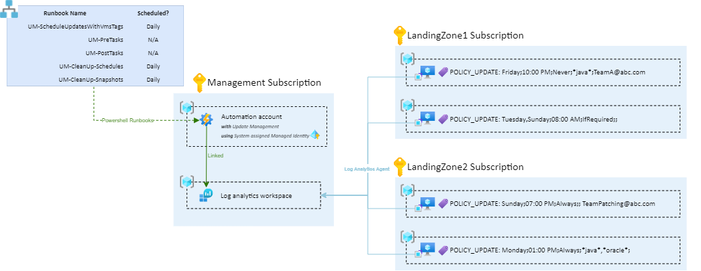
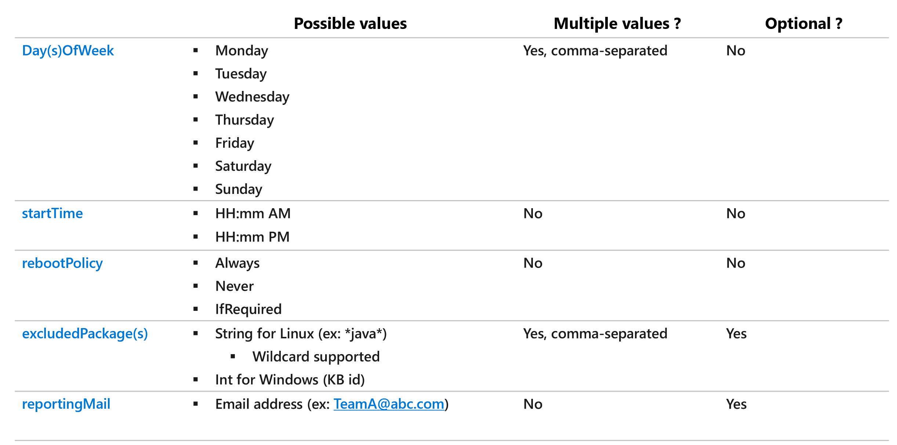

# Azure-vm-update-management# Azure Update Management - Schedule VM patching with tags 

This repo is a set of Runbooks that allows you to schedule Azure Virtual Machines patching by simply applying the `POLICY_UPDATE` tag on machines.

- [Azure Update Management - Schedule VM patching with tags](#azure-update-management---schedule-vm-patching-with-tags)
- [Global Picture](#global-picture)
  - [`POLICY_UPDATE` syntax](#policy_update-syntax)
  - [Features](#features)
  - [Unsupported scenarios](#unsupported-scenarios)
  - [Runbooks description](#runbooks-description)
  - [Limitations](#limitations)
- [Getting started](#getting-started)
  - [Quick deployment (for testing purpose)](#quick-deployment-for-testing-purpose)
  - [Production Deployment & Recommendations](#production-deployment--recommendations)
- [Authors](#authors)

# Global Picture



Shared Runbooks need the following initial bricks to work:
* A Log Analytics Workspace
* An Automation Account linked to the Log Analytics Workspace
  * The Automation account must use a System-assigned Managed Identity
  * The System-assigned Managed Identity must have **Contributor** role 
    * assigned on all subscriptions where machines (Azure VMs or Azure Arc Servers) can be found
    * assigned to the Resource Group where the Automation Account is located
* Machines that need to be patched must have:
  * Log Analytics Agent Extension installed, and linked to the Log Analytics Workspace
  * `POLICY_UPDATE` key tag declared with appropriated value

## `POLICY_UPDATE` syntax 

Here is the syntax to follow for the `POLICY_UPDATE` tag:

 

**Examples**:
* VM1 - `POLICY_UPDATE=Friday;10:00 PM;Never;*java*;` will be patched every Friday, at 10:00 PM. Even if updates require reboot, the VM will not be rebooted. Packages containing `java` string will be excluded.
* VM2 - `POLICY_UPDATE=Tuesday,Sunday;08:00 AM;IfRequired;;TeamA@abc.com` will be patched every Tuesday and Sunday, at 08:00 AM. The VM will be rebooted only if a patch needs the machine to be reboot to be taken into account. No excluded packages. When patching is done, TeamA@abc.com will receive the list of updated packages by mail.
* VM3 - `POLICY_UPDATE=Sunday;07:00 PM;Always;;` will be patched every Synday at 07:00 PM. The VM will be rebooted after applying patches, even if it is not required. No excluded packages.
* VM4 - `POLICY_UPDATE=Monday;01:00 PM;Always;*java*,*oracle*;TeamB@abc.com` will be patched every Monday at 01:00 PM. The VM will be rebooted after applying patches. Packages containing `java` or `oracle` string will be excluded. When patching is done, TeamB@abc.com will receive the list of updated packages by mail.

## Features

Shared Runbooks allows you to:
* Patch **Azure Virtual Machines** and **Azure Arc Servers** with [Supported OS](https://docs.microsoft.com/en-us/azure/automation/update-management/operating-system-requirements#supported-operating-systems)
* Patch in a multi-subscriptions context: the system-assigned managed identity must have **Contributor** role assigned on each subscription.
* Perform several pre and post patching tasks:
  * Pre scripts, before patching:
    * [OPTIONAL] Snapshot VM OS disk 
    * [OPTIONAL] Start VM if it is stopped 
  * Post scripts, after patching:
    * [OPTIONAL] Shutdown VM if it was started by pre-script.
    * [OPTIONAL] Send a patching report email
* Support Azure Arc Server
  * Pre-scripts and post scripts are not supported for Azure Arc Servers
    * You can schedule Azure Arc Servers restarts using `POLICY_RESTART` tag with Runbooks available in [this repo](https://github.com/mastechdom/Azure-vm-update-management)

## Unsupported scenarios

Below Azure Resource cannot be patched by Azure Update Management:
* [VMSS](https://docs.microsoft.com/en-us/azure/virtual-machine-scale-sets/overview): Leverage [automatic OS image upgrade](https://docs.microsoft.com/en-us/azure/virtual-machine-scale-sets/virtual-machine-scale-sets-automatic-upgrade) instead.
* [AVD](https://docs.microsoft.com/en-us/azure/virtual-desktop/): Leverage [automatic updates](https://docs.microsoft.com/en-us/azure/virtual-desktop/configure-automatic-updates) instead.
* [AKS](https://docs.microsoft.com/en-us/azure/aks/): Leverage [auto-upgrade channel](https://docs.microsoft.com/en-US/azure/aks/upgrade-cluster#set-auto-upgrade-channel) and [planned-maintenance](https://docs.microsoft.com/en-us/azure/aks/planned-maintenance) instead.

## Runbooks description

There is a set of 5 Runbooks that must be deployed in the Automation Account:
* **UM-ScheduleUpdatesWithVmsTags**: Must be scheduled (at least) daily. Searches for all machines with the `POLICY_UPDATE` tag and configures the Update Management schedules.
* **UM-PreTasks**: Triggered before patching, it can perform several optional actions like OS disk snapshot, start VM if stopped, etc..
* **UM-PostTasks**: Triggered after patching, it can perform several optional actions like stop VM if it was started, send patching report mail, etc..
* **UM-CleanUp-Snapshots**: Must be scheduled daily, to delete snapshots that are X days older.
* **UM-CleanUp-Schedules**: Must be schedule (at least) daily. It removes Update Management schedules for VM machines that not longer have the `POLICY_UPDATE` tag

## Prerequisites

Automation Account must have the following modules installed:
* Az.ResourceGraph, >= 0.11.0
* Az.ConnectedMachine >= 0.2.0
* Az.Automation >= 1.7.1
* Az.Compute >= 4.17.1

**Note**: Runbooks must be deployed using Powershell Runtime v5.1 

## Limitations

* VMs must have a unique name. It is not possible to have several VMs with the same name using `POLICY_UPDATE` tag.
* A VM must be part of a single schedule. If it is not the case, *UM-CleanUp-Schedules* has side effects.
* When the `POLICY_UPDATE` tag is applied, the first patching can be done the day after the execution of *UM-ScheduleUpdatesWithVmsTags*.

# Getting started

## Quick deployment (for testing purpose)

To quickly test provided Runbooks, use the provided bicep script to deploy a complete testing infrastructure that will: 
* Deploy a Log Analytics Workspace
* Deploy an Automation Account using a System-assigned Magaged Identity
  * Install Update Management solution
  * Assign *Contributor* role on the System-assigned Managed Identity to the Resource Group
* Deploy 5 Runbooks to the Automation Accounts and schedule few of them
* Deploy 1 VNet
* Deploy 6 VMs (3 Windows, 3 Linux) in the VNet
  * with Log Analytics agent installed and plugged to the Log Analytics Workspace
  * with `POLICY_UPDATE` tag examples
* If you want to receive a **mail report**, 2 variables in the Automation Account needs to be defined : 
  * SendGridAPIKey (type: secure string): API access key provided by SendGrid to use your account
  * SendGridSender (type: string): Sender email address (from) configured on SendGrid

Here is a *partial* screenshot of deployed resources:
 

**Quick start:**

* Prerequisites:

# Step-by-step user guide [video]()

```bash

# Clone the repo with following command

$ git clone https://github.com/mastechdom/Azure-vm-update-management.git

...
#Then I run terrraform script to connnect azure account

$ cd terraform

$ terraform fmt
$ terraform init
$ terraform plan
$ terraform validate
$ trraform apply

...
#Then run bicep file to deploye

$ cd Azure-vm-update-management/bicep
```

* Deploy **without email feature**:
```bash
$ az deployment group create --resource-group your-resource-group-name --template-file main.bicep
```
If you want to enable patching report email feature later, just update `SendGridSender` and `SendGridAPIKey` Automation Account variables.

* Deploy **with email feature**:
```bash
$ az deployment group create --resource-group MyRg --template-file main.bicep --parameters SendGridSender="no-reply@mydomain.fr" SendGridAPIKey="SG.XXXXXXXXXXXXX-XXXXXXXXXXXXXXXXXXX-XXXXXXXXXXXXXXXXXXXXXXXX"
```
Infrastructure deployment will take around 5 minutes and it can take until 20 minutes to have update agent ready and first patching assessment. 


# Output images
(https://drive.google.com/file/d/1v8OeGX98JJfQCQ_bbkB4JGKU_dBqcThX/view?usp=drive_link)

